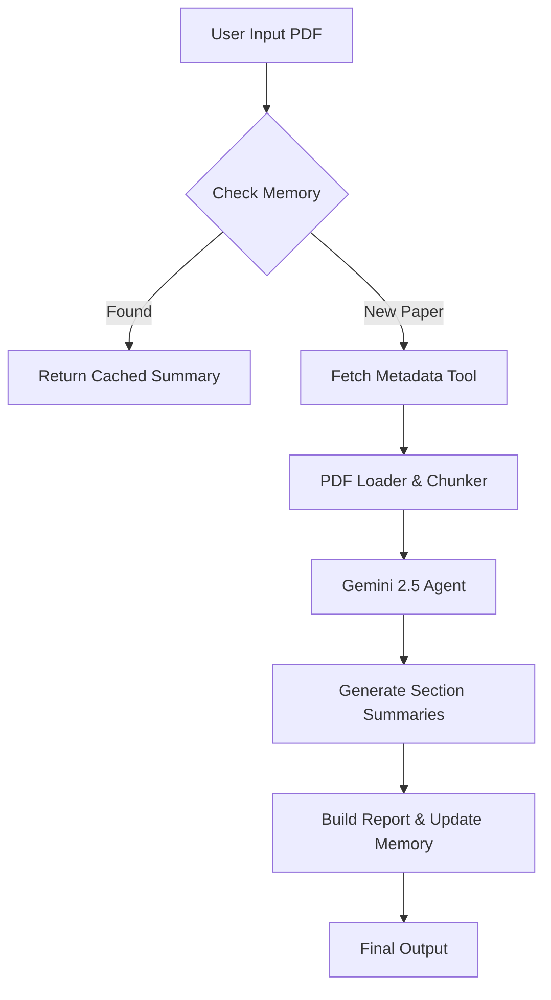

# 📚 Summarizer for Research — AI Agent

A smart **AI Agent** that automates the reading, chunking, and summarization of academic research papers. Built for the **Kaggle 5-Day AI Agents Challenge**, this project demonstrates an agentic workflow with long-term memory, external tool usage, and context-aware summarization.

---

## 📖 Table of Contents
- [Project Overview](#-project-overview)
- [Why Agents?](#-why-agents)
- [Agentic Architecture](#-agentic-architecture)
- [Features](#-features)
- [Installation & Setup](#-installation--setup)
- [Usage](#-usage)
- [Project Structure](#-project-structure)
- [Future Improvements](#-future-improvements)

---

## 🎯 Project Overview

Reading research papers is time-consuming. Traditional LLM summarizers often fail on long PDFs due to context limits or hallucinations. 

**Summarizer for Research** is not just a script—it's an **Autonomous Agent**. It:
1.  **Reads** raw PDF files.
2.  **Checks Memory** to see if it has already processed this paper (saving time & API costs).
3.  **Fetches Metadata** from the web (CrossRef) to verify authors and publication years.
4.  **Chunks** text intelligently using token limits.
5.  **Summarizes** section-by-section using **Google Gemini 2.5 Flash**.
6.  **Compiles** a structured Markdown report and JSON data file.

---

## 🤖 Why Agents?
Unlike a standard "RAG" script, this system exhibits **agentic reasoning**:

1.  **State Awareness (Memory):** Before doing expensive work, the agent checks its internal database (`memories.json`). If the paper exists, it retrieves the result instantly instead of re-processing.
2.  **Tool Use:** It autonomously calls a custom `pdf_loader` tool and a `metadata_fetcher` API tool to gather context before summarization.
3.  **Structured Output:** It forces the LLM to output strict JSON for data reliability, then parses it into a human-readable report.

---

## 🏗️ Agentic Architecture

## ✨ Features

🧠 Long-Term Memory: Stores processed papers in data/memories.json. The agent "remembers" what it has read. 
⚡ Google Gemini 2.5 Flash: Utilizes the latest high-speed, low-latency model from Google. 
✂️ Smart Chunking: Uses tiktoken to split PDFs into token-safe chunks, ensuring no text is cut off mid-sentence. 
🌍 External Metadata Tool: Fetches real DOI, Author, and Journal data using the CrossRef API. 
📊 Dual Output: Generates a readable Markdown Report for humans and JSON Data for developers. 

## 🛠️ Installation & Setup
1. Clone the Repository 
   git clone [https://github.com/Pruthvi-raj-cell/Summarizer-for-Research-AI-Agent.git](https://github.com/Pruthvi-raj-cell/Summarizer-for-Research-AI-Agent.git)
cd Summarizer-for-Research-AI-Agent 

2. Install Dependencies 
   pip install -r requirements.txt 
 Ensure Google Generative AI SDK is installed 
pip install google-generativeai 

3. Configure API Keys
   Create a .env file in the root directory and add your key: 
   GOOGLE_API_KEY=your_actual_api_key_here 

## 🚀 Usage

Basic Run
Run the agent on any PDF file. If you don't have one, it will auto-download a test paper.
 
Output

The agent will create an output/ folder containing: 
paper_name_summary.md (The readable report) 
paper_name_data.json (The raw structured data)sh 

Testing Memory

Run the command a second time on the same file to see the agent's memory in action: 

python main.py test_paper.pdf 

## 📂 Project Structure
<pre>
├── core/
│   ├── pdf_loader.py       # Tool: Extracts raw text from PDFs
│   ├── text_chunker.py     # Logic: Splits text into safe token limits
│   ├── summarizer_agent.py # Agent: Handles LLM interaction (Gemini)
│   ├── report_builder.py   # Logic: Assembles final Markdown/JSON
│   └── memory_manager.py   # System: Handles reading/writing to JSON DB
├── tools/
│   └── metadata_fetcher.py # Tool: Connects to CrossRef API
├── data/
│   └── memories.json       # Database: Stores agent's long-term memory
├── output/                 # Artifacts: Final generated reports
├── main.py                 # Orchestrator: Connects all agent components
├── requirements.txt        # Dependencies
└── README.md               # Documentation
</pre>

## 🔮 Future Improvements

[ ] Multi-Agent Debate: Add a second agent to "critique" the summary for accuracy. 
[ ] Vector Database: Upgrade memories.json to a vector store (ChromaDB) for semantic search. 
[ ] Chat Interface: Allow users to ask questions about the summarized paper. 
